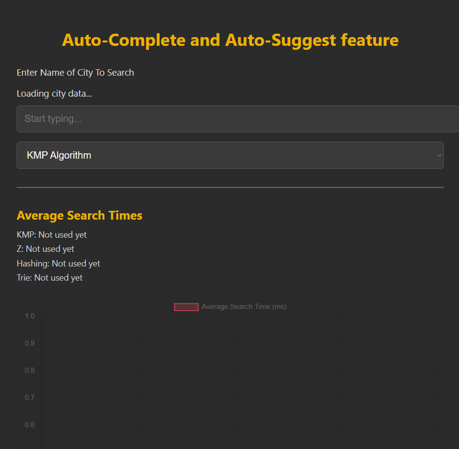

# 🔍 Auto-Complete and Auto-Suggest Feature

An interactive web application that demonstrates and compares different string search algorithms for auto-complete functionality using city name data.

## 🚀 Features

- 🔤 **Real-time auto-suggestions** while typing city names
- 🧠 Supports multiple string search algorithms:
  - **KMP (Knuth-Morris-Pratt)**
  - **Z Algorithm**
  - **Hashing**
  - **Trie-based search**
- 📊 **Performance Metrics**:
  - Average search time recorded and visualized for each algorithm
  - Comparison chart to analyze efficiency
- 🌐 **Clean and intuitive UI** with algorithm selector
- 🌙 Dark theme for better user experience

## 📸 Preview



## ⚙️ Tech Stack

- **Frontend**: HTML, CSS (Dark Mode), JavaScript
- **Visualization**: Chart.js or similar (for plotting performance metrics)
- **Search Algorithms**: Implemented in pure JavaScript

## 📁 Project Structure

```
├── index.html
├── style.css
├── script.js
├── cities.json (or fetched from an API)
├── algorithms/
│   ├── kmp.js
│   ├── zAlgorithm.js
│   ├── hashing.js
│   └── trie.js
└── README.md
```

## 🧪 How to Use

1. Open the app in your browser.
2. Wait for city data to load.
3. Start typing in the search bar.
4. Choose an algorithm from the dropdown.
5. Observe suggestions and performance metrics.

## 📈 Future Improvements

- Add more datasets (e.g., country names, user names)
- Allow user-defined text inputs
- Export search performance as CSV
- Mobile responsiveness
